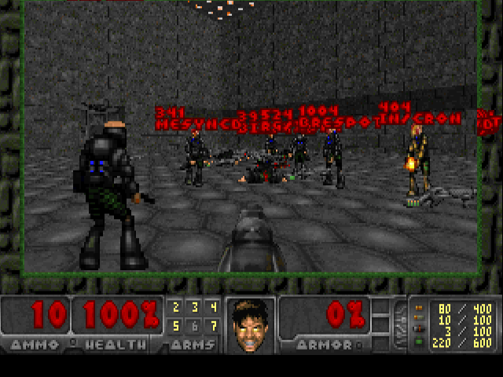

# arbiterdoom
psDooM but where the processes belong to bad users detected by [Arbiter](https://github.com/CHPC-UofU/arbiter2). Built using [psdoom-ng](https://github.com/orsonteodoro/psdoom-ng). You can read more about the infamous psDooM [here](http://psdoom.sourceforge.net/).

## Installation

Install requirements (gcc, make, libsdl1.2):

```bash
apt install gcc make libsdl1.2-dev libsdl-mixer1.2-dev libsdl-net1.2-dev
```

Build psdoom-ng (based on [chocolate-doom](https://www.chocolate-doom.org/wiki/index.php/Building_Chocolate_Doom_on_Linux)):

```bash
cd psdoom-ng1
./autogen.sh
export PREFIX=/usr/local
./configure --prefix ${PREFIX}
make
make install
# Install custom psdoom levels
mkdir -p ${PREFIX}/share/games/doom
tar xf contrib/psdoom-2000.05.03-data.tar.gz -C ${PREFIX}/share/games/doom
cp ${PREFIX}/share/games/doom/psdoom-data/*.wad ${PREFIX}/share/games/doom
rm -rf ${PREFIX}/share/games/doom/psdoom-data/
DESTDIR=${PREFIX} make install
cp ../freedm.wad ${PREFIX}/share/games/doom
```

Install picker module (cause I'm lazy and want fancy picking):

```bash
python3 -m pip install pick
```

Setup `ARBDIR`, `ARBETC` and `ARBCONFIG` (if they aren't already set up):

```bash
ARBBASEDIR="/usr/local/src/Arbiter2/1.3.3/"
export ARBDIR="$ARBBASEDIR/arbiter"
export ARBETC="$ARBBASEDIR/etc"
export ARBCONFIG="$ARBETC/config.toml $ARBETC/_nomemsw.toml $ARBETC/_noperms.toml"
```

Install arbdoom

```bash
mkdir -p ${PREFIX}/share/games/doom/psdoom-ng/arbiterdoom
cp ../arbdoom-*.sh ${PREFIX}/share/games/doom/psdoom-ng/arbiterdoom
cp ../arbdoom.py ${PREFIX}/bin
# Modify arbdoom file to use the correct $PREFIX:
cat <<EOF > arbdoom
#!/bin/sh
# Note: You may want to put the ARB* env vars in here!
export ARBDOOMDIR="${PREFIX}/share/games/doom/psdoom-ng/arbiterdoom"
export PATH="$PATH:${PREFIX}/bin"
${PREFIX}/bin/arbdoom.py
EOF
chmod +x arbdoom
cp arbdoom ${PREFIX}/bin
```

## Running

As long as the installation of psdoom-ng goes smoothly:

```bash
./arbdoom
```

You may find the following flags and environment variables influential:

| Flags and Env Vars | Description |
| --- | --- |
| `-m`/`--arbdoom`/`$ARBDOOMDIR` | Sets the directory in which the arbiterdoom scripts are loaded from. Defaults to `$ARBDOOMDIR` if present or `~/.psdoom-ng/arbiterdoom` otherwise. |
| `-a`/`--arbdir`/`$ARBDIR` | Sets the directory in which arbiter modules are loaded from. Defaults to `$ARBDIR` if present or `../arbiter` otherwise. |
| `-g`/`--config`/`$ARBCONFIG` | The configuration files to use for finding the location of the statusdb. Configs will be cascaded together starting at the leftmost (the primary config) going right (the overwriting configs). Defaults to `$ARBCONFIG` if present or `../etc/config.toml` otherwise. |

## Screenshots



